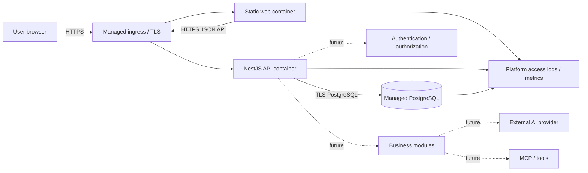

# Deployment Architecture

## Actual Components

| Component                            | Status                                       | Boundary                                   |
| ------------------------------------ | -------------------------------------------- | ------------------------------------------ |
| React web shell                      | Implemented; static production artifact      | Public frontend                            |
| NestJS API foundation                | Implemented; versioned HTTP service          | Private application service behind ingress |
| PostgreSQL schema and connectivity   | Implemented locally; not production-deployed | Persistent managed data service required   |
| Authentication and business services | Not implemented                              | Release blocker                            |
| AI/LLM provider                      | Not implemented or selected                  | Future external service                    |
| MCP/tools                            | Not implemented                              | Future optional integration                |
| Jobs, queue, cache, object storage   | Ports/plans only                             | Future services selected by need           |
| Central logging, metrics, alerting   | Provider not selected                        | Infrastructure gate                        |

## Target Request Path

The dotted components are not present. Containers write ephemeral application data only; PostgreSQL and future private object storage are the persistent stores. Production must use managed ingress, TLS, secrets, PostgreSQL, logging, metrics, and backups selected at the Infrastructure Decision Gate.

## Container Boundaries

- `Dockerfile.web` builds the Vite artifact and serves it as a non-root Node process on port 8080.
- `Dockerfile.api` builds and deploys production API dependencies, runs as the non-root `node` user, and listens on port 3000.
- Each image has a liveness health check. API readiness remains a separate traffic-admission check.
- `compose.local.yaml` is for local development only. It binds services to loopback and is not a production topology.
